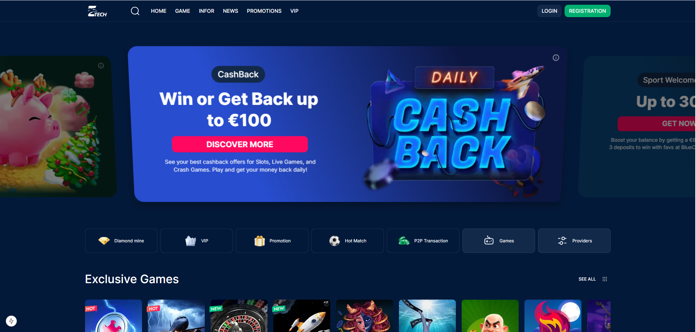
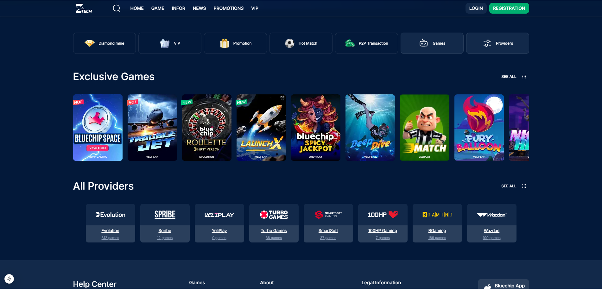
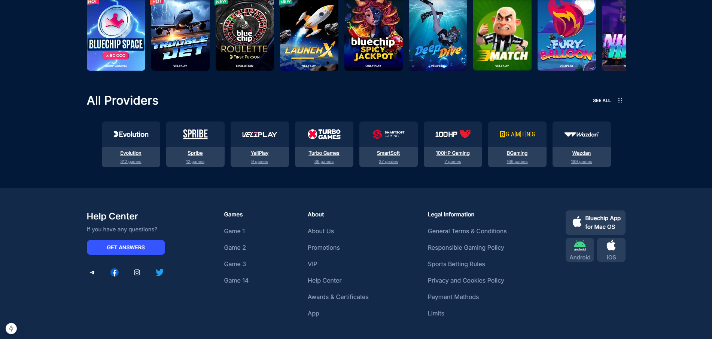
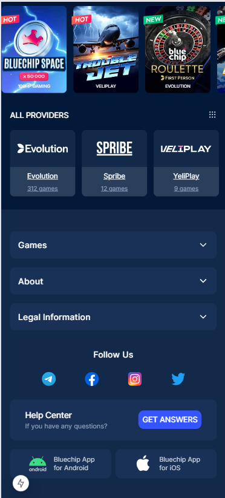
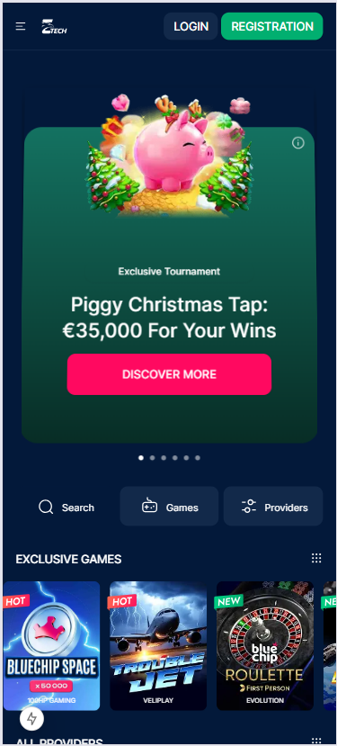

# Bluechip - Nền tảng Game Trực tuyến

Dự án Next.js hiện đại với giao diện người dùng đẹp mắt và phản hồi nhanh, được tối ưu hóa cho cả thiết bị di động và máy tính để bàn.



## Tổng quan

Bluechip là một nền tảng game trực tuyến cung cấp nhiều trò chơi độc quyền từ các nhà cung cấp hàng đầu. Dự án được xây dựng bằng Next.js và Tailwind CSS, tạo ra trải nghiệm người dùng mượt mà và hấp dẫn.

### Tính năng chính

- **Trò chơi độc quyền**: Bộ sưu tập các trò chơi độc quyền với thiết kế hấp dẫn
- **Nhiều nhà cung cấp**: Tích hợp với nhiều nhà cung cấp game hàng đầu
- **Giao diện đáp ứng**: Tối ưu hóa cho cả thiết bị di động và máy tính để bàn
- **Giải đấu độc quyền**: Các giải đấu đặc biệt với phần thưởng hấp dẫn
- **Ứng dụng di động**: Hỗ trợ cả iOS và Android



## Công nghệ sử dụng

- **Next.js**: Framework React cho phát triển web hiện đại
- **Tailwind CSS**: Framework CSS tiện ích để tạo giao diện tùy chỉnh
- **TypeScript**: Ngôn ngữ lập trình JavaScript với kiểu dữ liệu tĩnh
- **Vercel**: Nền tảng triển khai cho ứng dụng Next.js

## Cấu trúc dự án

- **/app**: Cấu trúc ứng dụng Next.js với định tuyến dựa trên tệp
- **/components**: Các thành phần UI có thể tái sử dụng
- **/assets**: Hình ảnh, biểu tượng và tài nguyên tĩnh
- **/contexts**: Context API của React để quản lý trạng thái ứng dụng



## Phiên bản di động

Dự án được tối ưu hóa đầy đủ cho thiết bị di động với giao diện người dùng đáp ứng và trải nghiệm mượt mà.



## Bắt đầu

Đầu tiên, chạy máy chủ phát triển:

```bash
npm run dev
# hoặc
yarn dev
# hoặc
pnpm dev
# hoặc
bun dev
```

Mở [http://localhost:3000](http://localhost:3000) với trình duyệt của bạn để xem kết quả.

## Ứng dụng di động

Bluechip có sẵn trên cả iOS và Android, cung cấp trải nghiệm di động đầy đủ tính năng.


